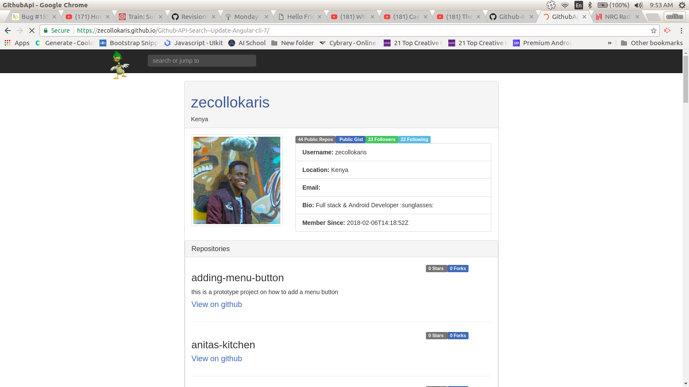

# Github-API-Search--Update-Angular-cli-7

## This app is called [Github Search:mag:](https://zecollokaris.github.io/Github-API-Search--Update-Angular-cli-7/).

### **This project was done using ANGULAR-Cli Version 7.** 

### **An update to a previous version in Angular-JS.**

#### ***Checkout the link for the older Version in Angular-JS*** :point_down:

-> ```https://github.com/zecollokaris/Github-API-Search-AngularJS```

#### [Checkout Deployed Site At :mag:](https://zecollokaris.github.io/Github-API-Search--Update-Angular-cli-7/)


# DISPLAY



# DESCRIPTION

This is a **Github Search :mag:** application that searches for user and displays their profile info using the ***Github API.***

This is a website where users may enter a GitHub username into a form, submit it, and see names and descriptions of that person's public repositories. 

GitHub API was used to retrieve this information. This API allows ***5,000*** requests per hour with an API key, but only 60 requests per hour _without_ one.

## User Story

- Users can enter Github user info info a form and submit it.

- Users can see names and descriptions of person's public repositories.

- Users can make up to 5000 requests per hour due to Github-API integration.

# Prerequisites

To work with Git-Search you need to have some few prerequisites.

This include the following mentioned however below however if you dont have the set below

You can check out the link below for installation instructions!

Link~  ```https://github.com/zecollokaris/Installation```


- Node.js

- Angular-JS framework

- Watchman

- Typescript

- Terminal

If you dont have this requirements you could use the link above to help with the installation guide.

# **SETUP/INSTALLATION.**

### **To work With Github Search**

1. You will need Internet connection.

2. You will also need a Webpage URL to load in URL's:

3. To get to use **GIT-SEARCH** fist you need to get to the Github-API-Search--Update-Angular-cli-7 repository. 

Link:-> ```https://github.com/zecollokaris/Github-API-Search--Update-Angular-cli-7```

4. From there you can access Git-search.

5. **Clone** the project.

6. Once you done with cloning and project is on your device.

7. get into project folder (cd into project).

8. On your **bash** terminal Run the command:- 

```
ng serve
```

9. Open your prefered **web browser** and load it on local host:

```
http://localhost:4200/
```

10. This will load for you Github Search as long as your requirements are satisfied.


# TECHNOLOGIES USED

1. Angular Version7 (Framework)

2. Type Script

3. Javascript

4. Bootstrap

5. CSS

## Development server
---

Run `ng serve` for a dev server. Navigate to `http://localhost:4200/`. The app will automatically reload if you change any of the source files.

## Deployment
---

App was deployed to [Github Pages](https://pages.github.com/) using Angular Cli, by publishing the **dist/** folder.

Link to Deployed [Github Search:mag:](https://zecollokaris.github.io/Github-API-Search--Update-Angular-cli-7/)


```
https://zecollokaris.github.io/Github-API-Search--Update-Angular-cli-7/
```

## Support and Contact
---

-Mobile number: (+254) 798731203

-Email Address: collo.kariss@gmail.com

-github-username: zecollokaris

## License
---

The app is licensed by MIT.

MIT (c) 2018